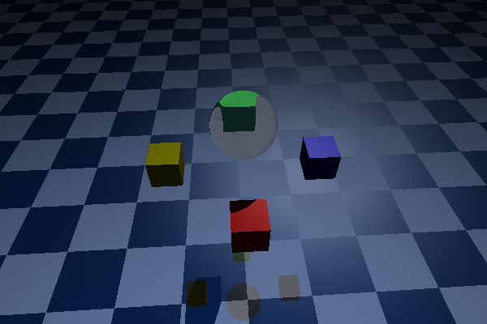
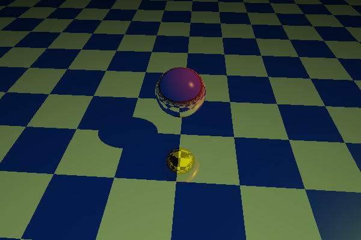
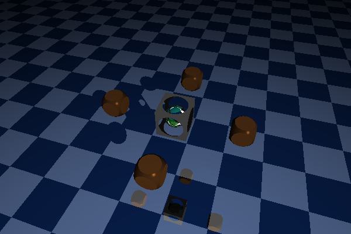

# T05RT: Ray tracing project
Last code update: 22.07.2022.

This project is implemetation of CPU-based ray tracing algoithm. It supports geometry primitives (such as spheres, cubes, cylinders, planes and their intersections/substractions), light sources (directional, spot and point), custom environments and surfaces.

Some screenshots:

